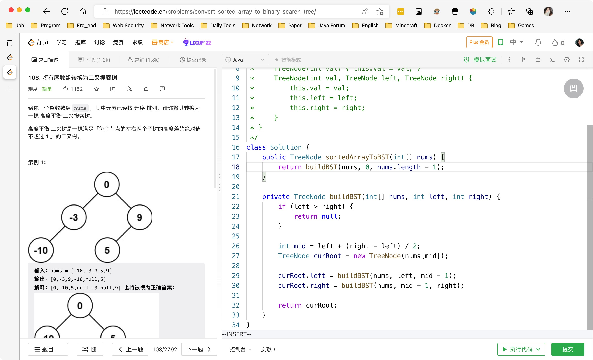
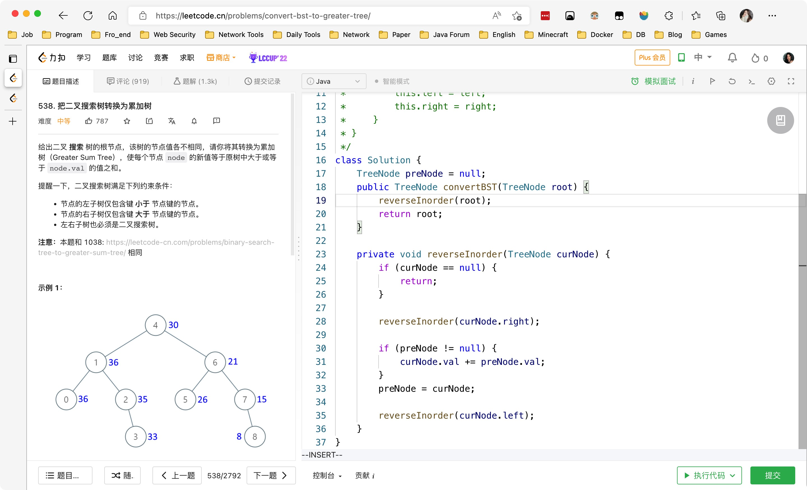
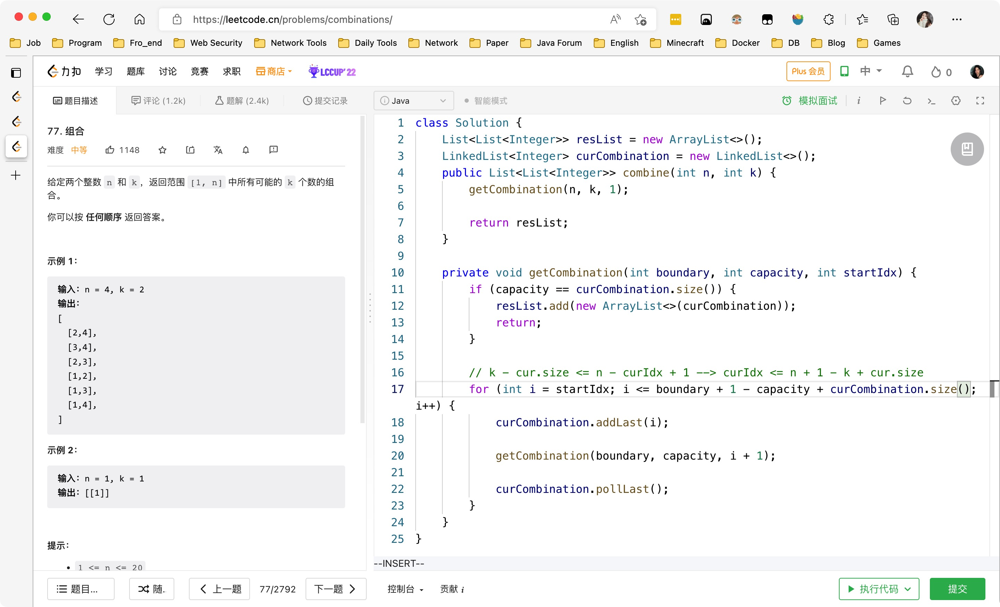
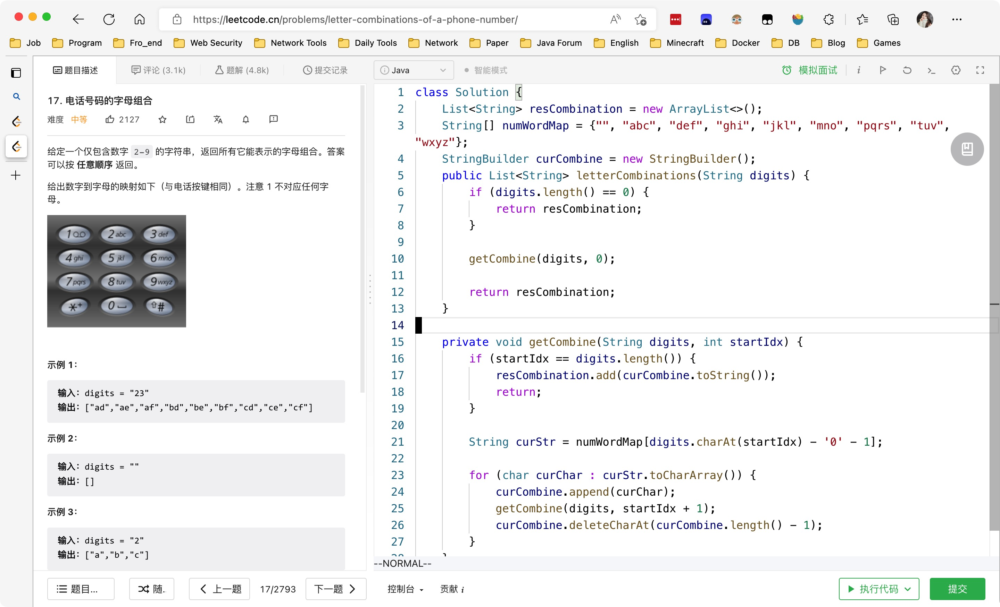
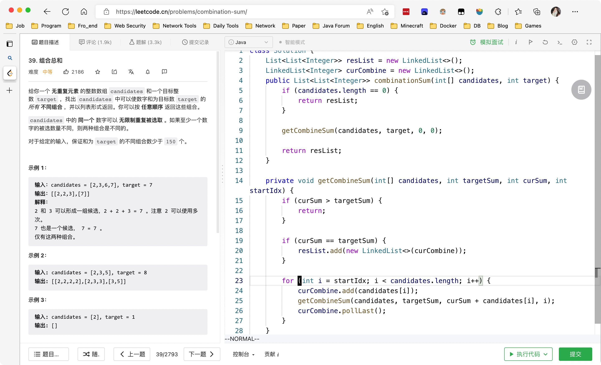
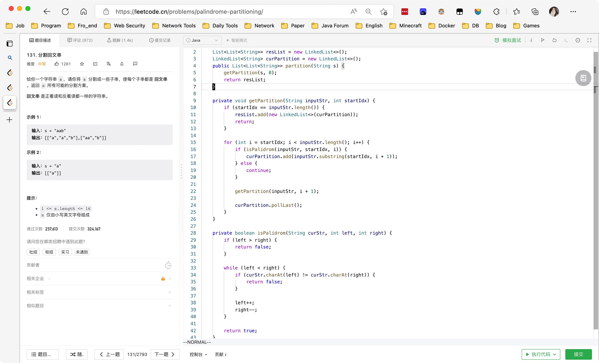
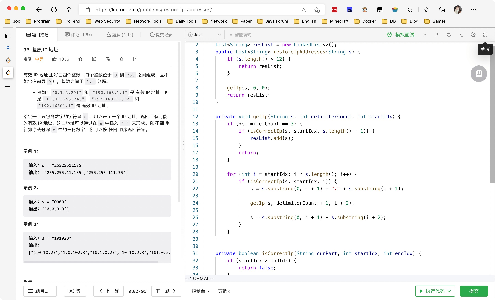
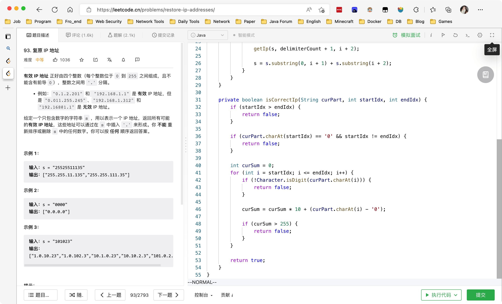
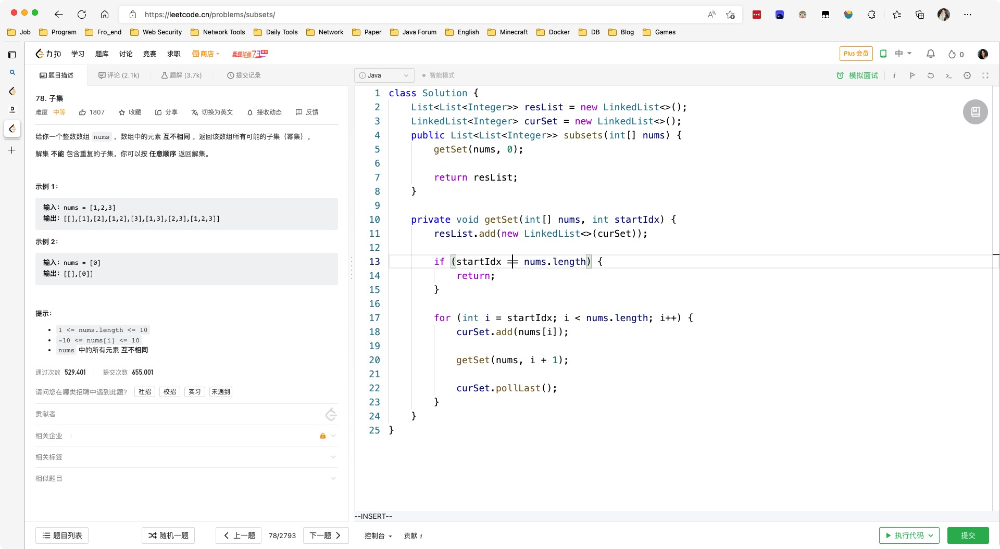
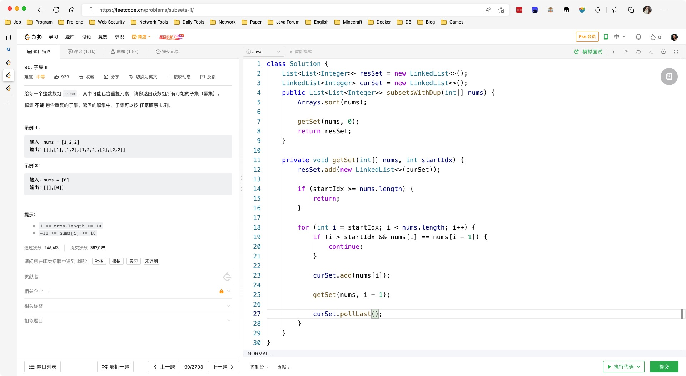

# Day429

&nbsp;

---

&nbsp;

# Day430

&nbsp;

# Day431

&nbsp;

&nbsp;

# Day432

&nbsp;

&nbsp;

# Mid-Week SQL

[【SQL练习】第79周周中练习_哔哩哔哩_bilibili](https://www.bilibili.com/video/BV1oW4y1Y7Af/)

&nbsp;

# Mid-Week Algorithm

[【一周算法总结】第79周周中算法总结_哔哩哔哩_bilibili](https://www.bilibili.com/video/BV19D4y117nh/?vd_source=0e2e4fb78a4d00f87c3860e1ba2bc5b7)

&nbsp;

# Day433

&nbsp;

&nbsp;

&nbsp;

# Day434

&nbsp;

