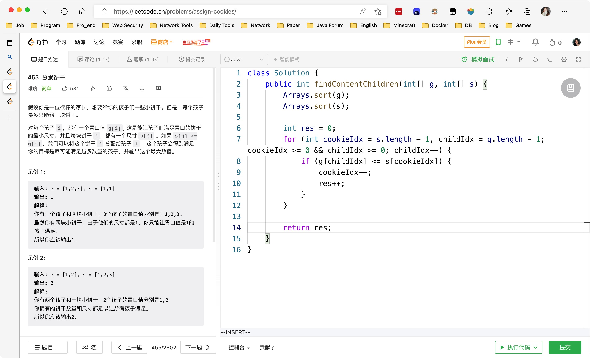

# Day436

&nbsp;

---

&nbsp;

# Day437

&nbsp;

# Day438

&nbsp;

# Day439

&nbsp;

# Mid-Week SQL

[【SQL练习】第80周周中练习_哔哩哔哩_bilibili](https://www.bilibili.com/video/BV1ne4y1n71u/?spm_id_from=333.1007.top_right_bar_window_dynamic.content.click&vd_source=0e2e4fb78a4d00f87c3860e1ba2bc5b7)

&nbsp;

# Mid-Week Algorithm

[【一周算法总结】第80周周中算法总结_哔哩哔哩_bilibili](https://www.bilibili.com/video/BV1XG4y1W7vQ/?vd_source=0e2e4fb78a4d00f87c3860e1ba2bc5b7)

&nbsp;

# Day440

&nbsp;

