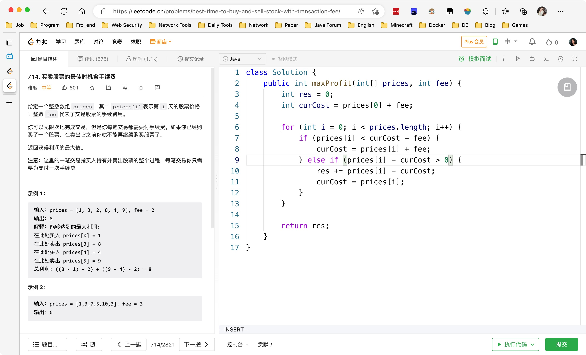
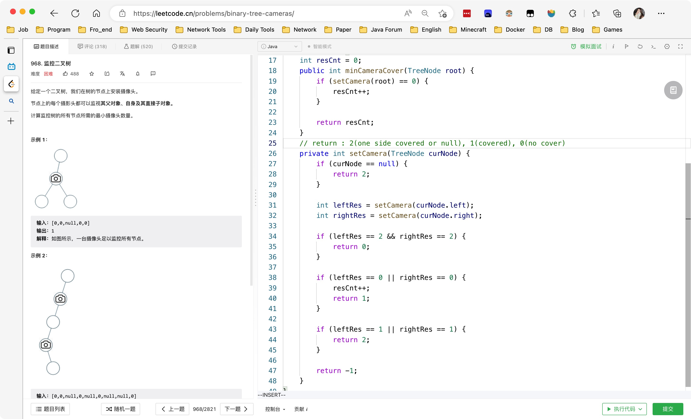
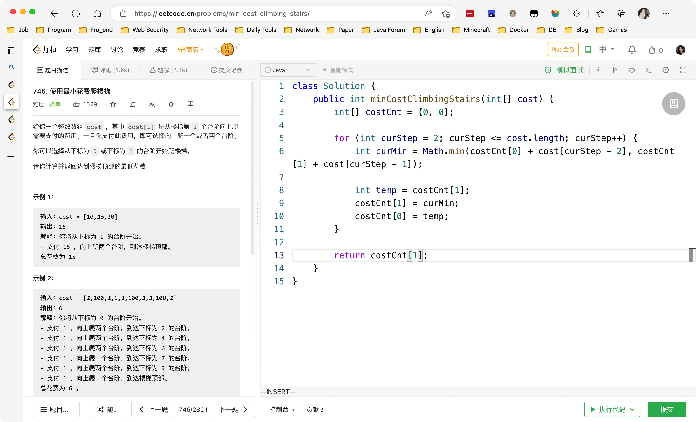
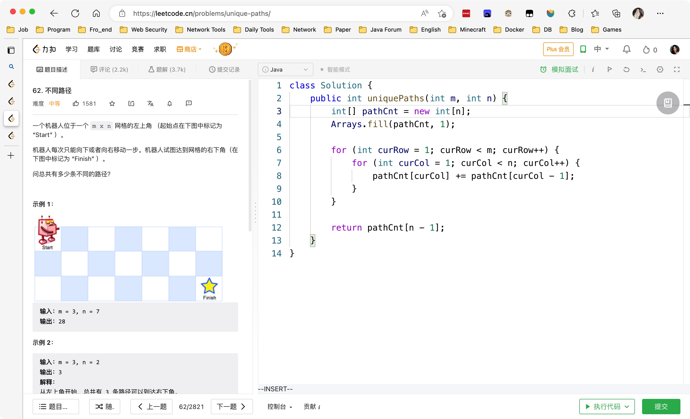
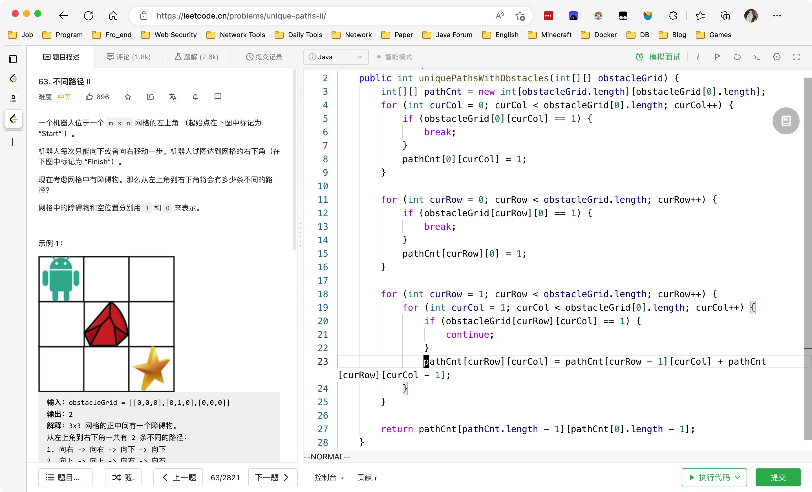
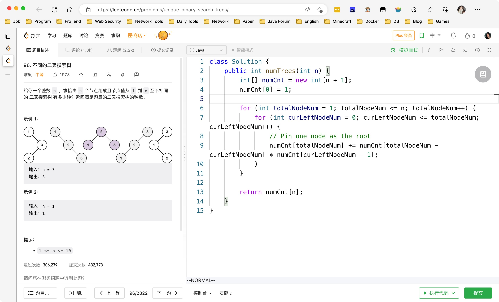

# Day450

&nbsp;

&nbsp;

# Day451

&nbsp;

# Day452

&nbsp;

# Day453

&nbsp;

# Mid-Weekly SQL

[【SQL练习】第82周周中练习_哔哩哔哩_bilibili](https://www.bilibili.com/video/BV1SK411S7uV/)

&nbsp;

# Mid-Weekly Algorithm

[【一周算法总结】第82周周中算法总结_哔哩哔哩_bilibili](https://www.bilibili.com/video/BV1XP411N7Zm/?vd_source=0e2e4fb78a4d00f87c3860e1ba2bc5b7)

