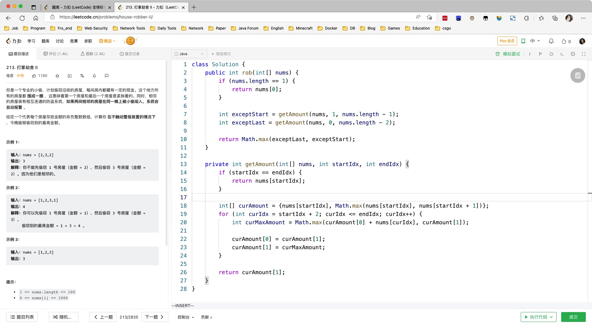
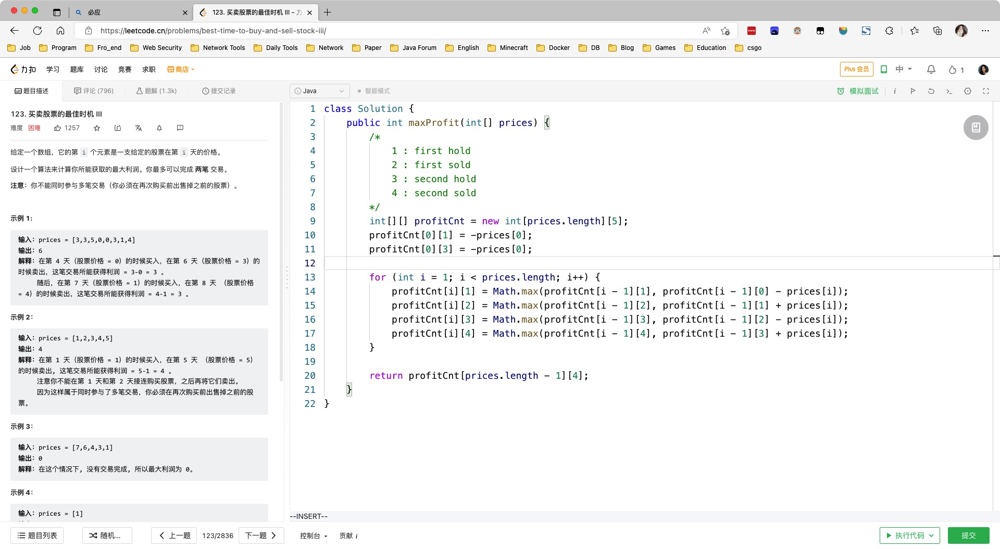

# Day464

&nbsp;

# Day465

&nbsp;

# Day466

&nbsp;

# Day467

&nbsp;

# Mid-Weekly Algorithm

[【一周算法总结】第84周周中算法总结_哔哩哔哩_bilibili](https://www.bilibili.com/video/BV1Ud4y1c7V8/?vd_source=0e2e4fb78a4d00f87c3860e1ba2bc5b7)

&nbsp;

# Mid-Weekly SQL

[【SQL练习】第84周周中练习_哔哩哔哩_bilibili](https://www.bilibili.com/video/BV1vg41167zT/?vd_source=0e2e4fb78a4d00f87c3860e1ba2bc5b7)

&nbsp;

# Day468

&nbsp;

# Day469

&nbsp;

# Day470

&nbsp;

# Weekly Algorithm

[【一周算法总结】第84周算法总结_哔哩哔哩_bilibili](https://www.bilibili.com/video/BV1Fe4y117Fb/?spm_id_from=333.1007.top_right_bar_window_dynamic.content.click&vd_source=0e2e4fb78a4d00f87c3860e1ba2bc5b7)

&nbsp;

# Weekly SQL

[【SQL练习】第84周练习_哔哩哔哩_bilibili](https://www.bilibili.com/video/BV118411h7u7/?vd_source=0e2e4fb78a4d00f87c3860e1ba2bc5b7)
