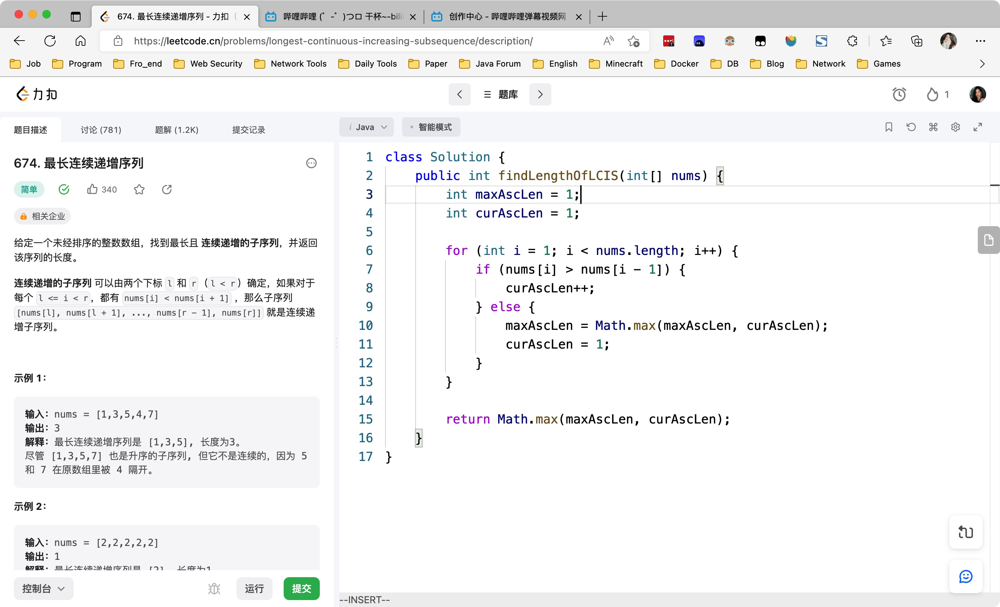
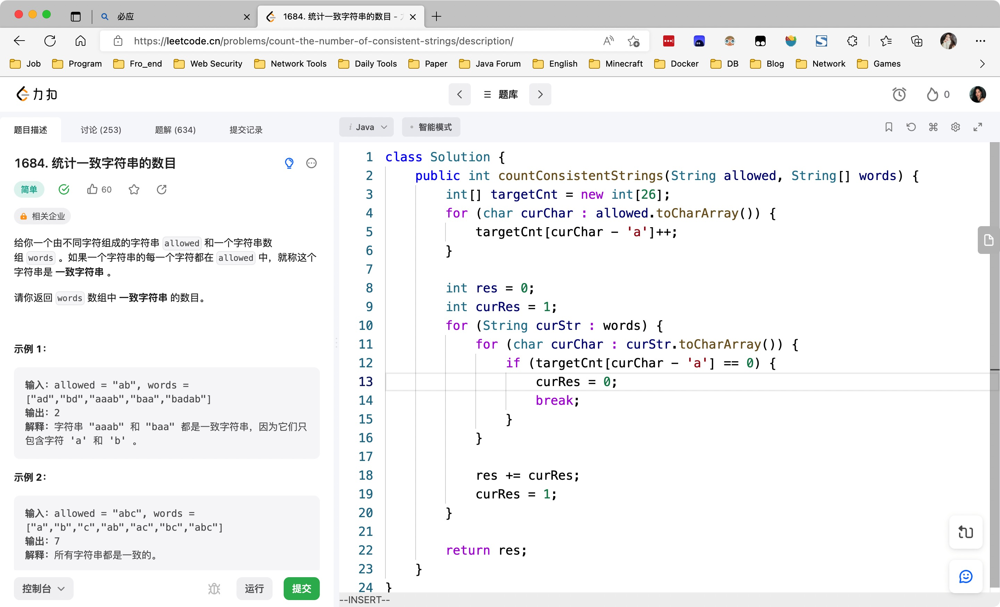
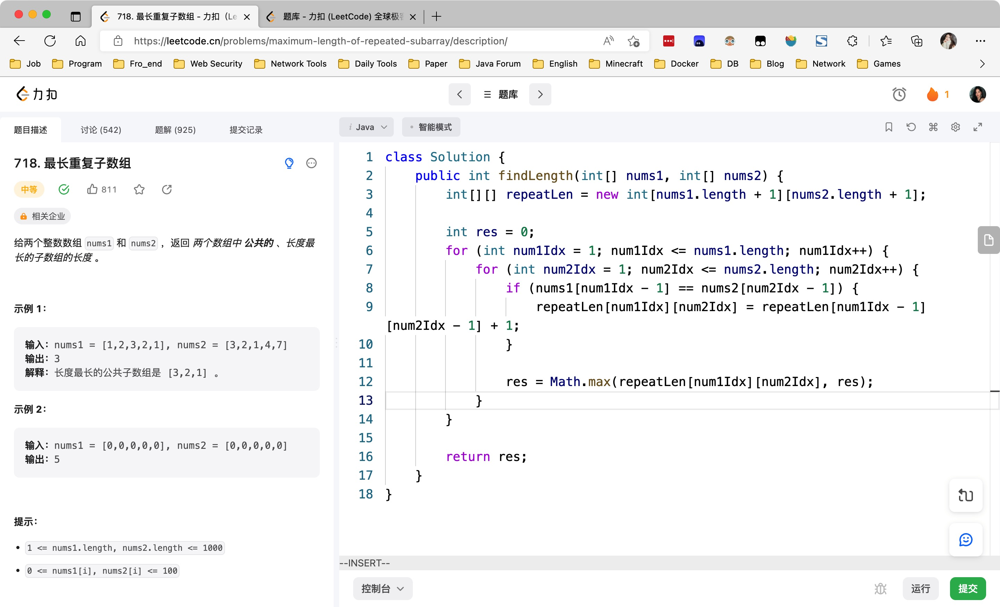
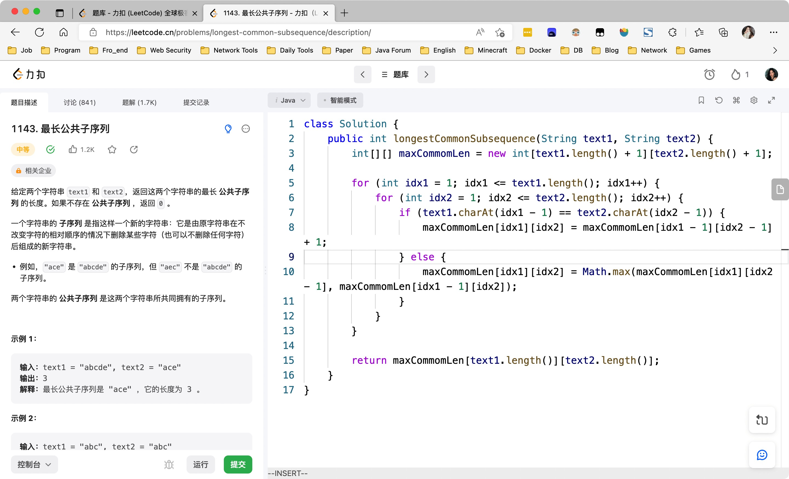
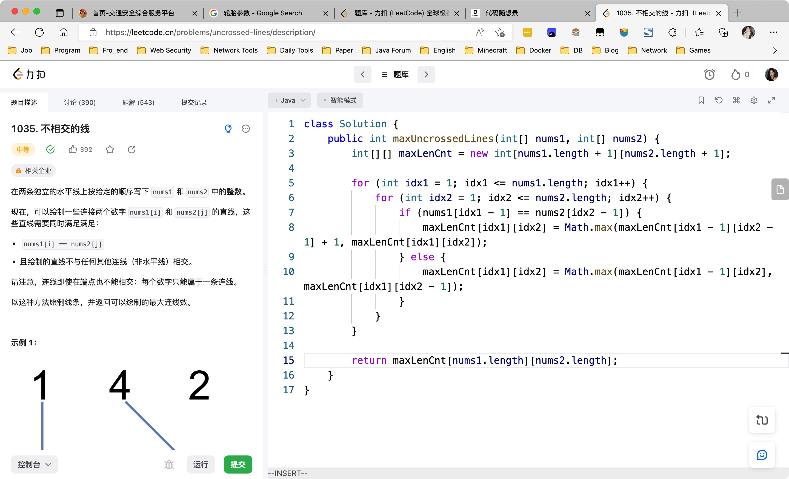
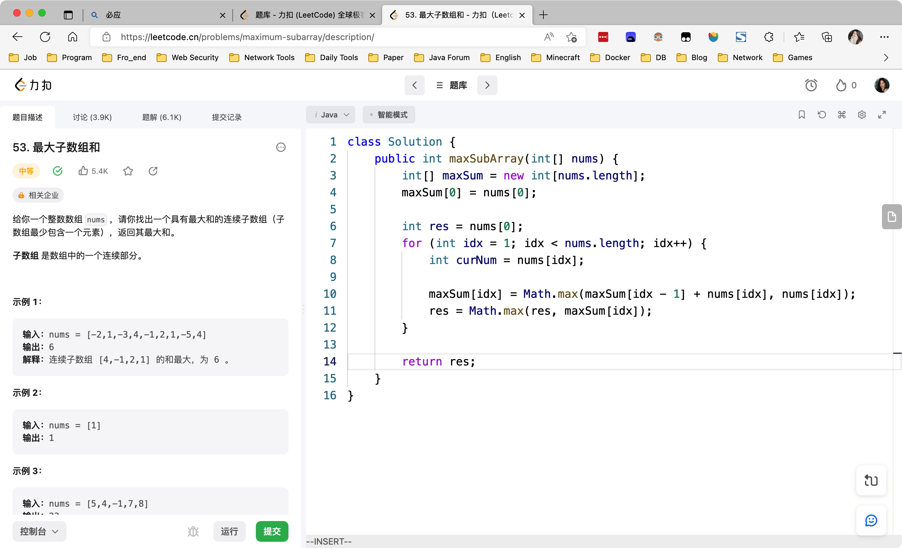
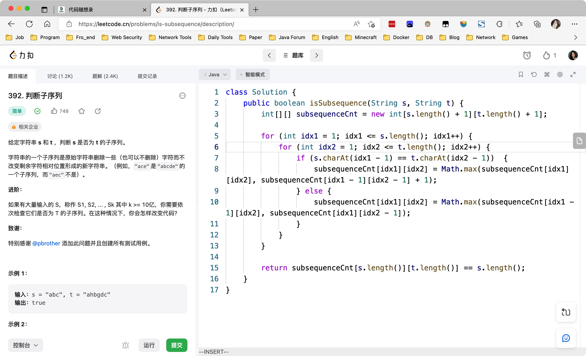
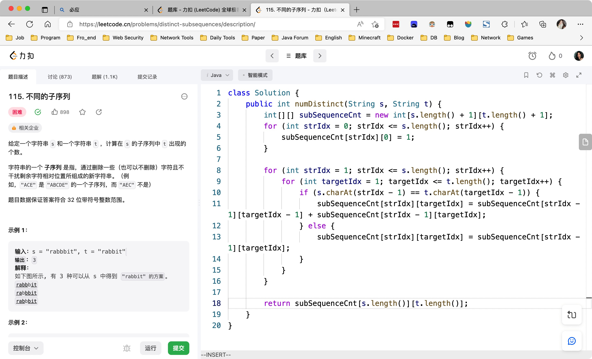

# Day471

&nbsp;

# Day472

&nbsp;

&nbsp;

# Day473

&nbsp;

# Day474

&nbsp;

# Mid-Weekly Algorithm

[【一周算法总结】第85周周中算法总结_哔哩哔哩_bilibili](https://www.bilibili.com/video/BV1m84y1v7nt/?vd_source=0e2e4fb78a4d00f87c3860e1ba2bc5b7)

&nbsp;

# Mid-Weekly SQL

[【SQL练习】第85周周中练习_哔哩哔哩_bilibili](https://www.bilibili.com/video/BV1Tv4y1S7RS/?spm_id_from=333.1007.top_right_bar_window_dynamic.content.click&vd_source=0e2e4fb78a4d00f87c3860e1ba2bc5b7)

&nbsp;

# Day475

&nbsp;

# Day476

&nbsp;

# Day477

