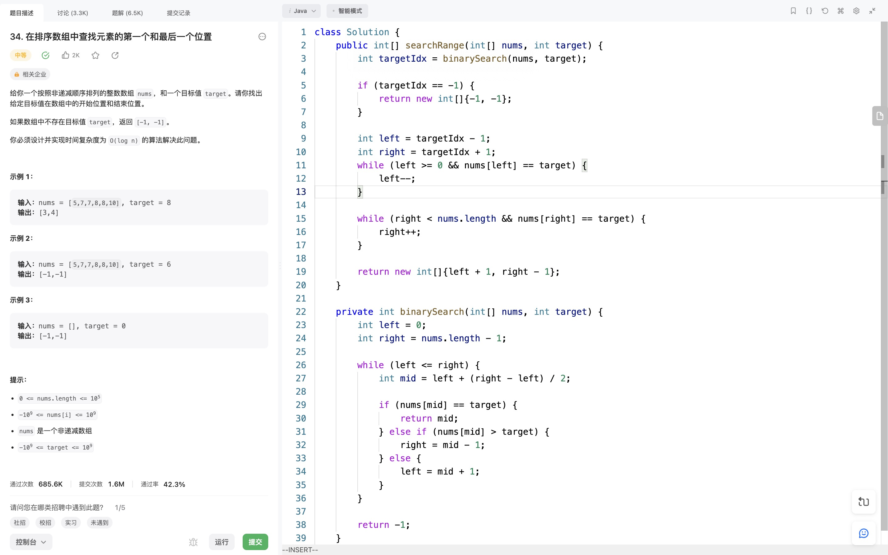

# Day485

&nbsp;

# Day486

&nbsp;

&nbsp;

# Day487

&nbsp;

---

# Day488

&nbsp;

&nbsp;

&nbsp;

# Mid-Weekly Algorithm

[【一周算法总结】第87周周中算法总结_哔哩哔哩_bilibili](https://www.bilibili.com/video/BV1Ed4y1t7x5/?vd_source=0e2e4fb78a4d00f87c3860e1ba2bc5b7)

&nbsp;

# Mid-Weekly SQL

[【SQL练习】第87周周中练习_哔哩哔哩_bilibili](https://www.bilibili.com/video/BV1HP411379g/?spm_id_from=333.1007.top_right_bar_window_dynamic.content.click&vd_source=0e2e4fb78a4d00f87c3860e1ba2bc5b7)

&nbsp;

# Day489

&nbsp;

&nbsp;

&nbsp;

# Day490

&nbsp;

&nbsp;

# Day491

