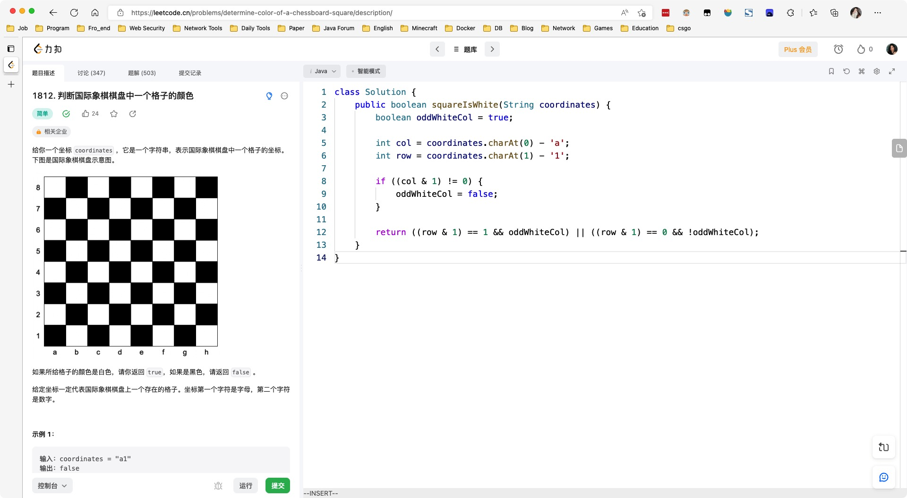

# Day499

&nbsp;

&nbsp;

&nbsp;

# Day500

&nbsp;

&nbsp;

# Day501

&nbsp;

&nbsp;

# Day502

&nbsp;

&nbsp;

&nbsp;

# Mid-Weekly SQL

[【SQL练习】第89周周中练习_哔哩哔哩_bilibili](https://www.bilibili.com/video/BV1vG4y1378N/?spm_id_from=333.1007.top_right_bar_window_dynamic.content.click&vd_source=0e2e4fb78a4d00f87c3860e1ba2bc5b7)

&nbsp;

# Day503

&nbsp;

&nbsp;

# Day504

&nbsp;

&nbsp;

# Day505

