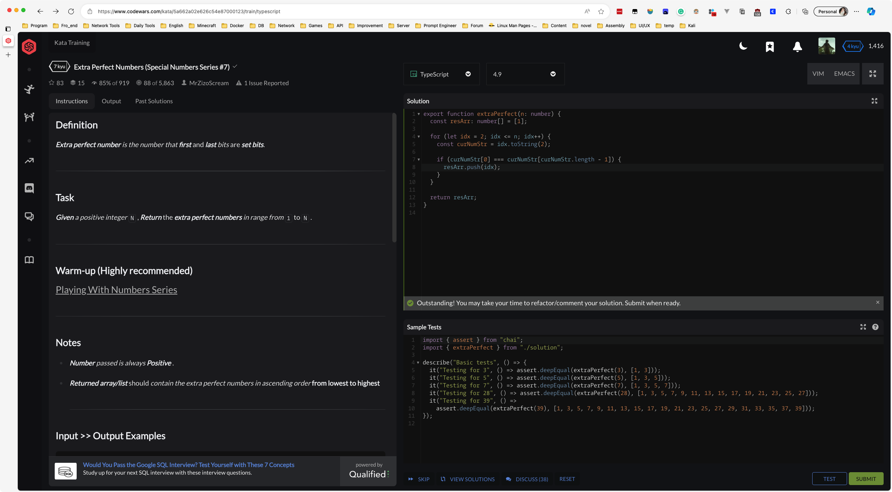
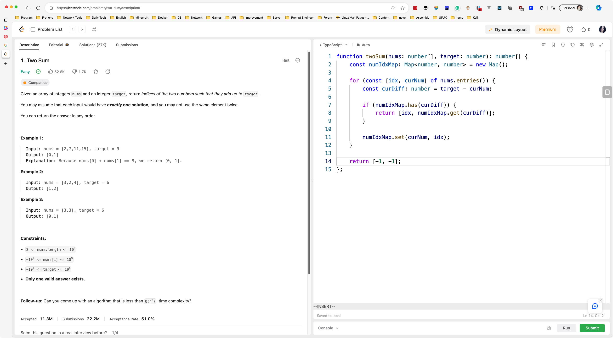
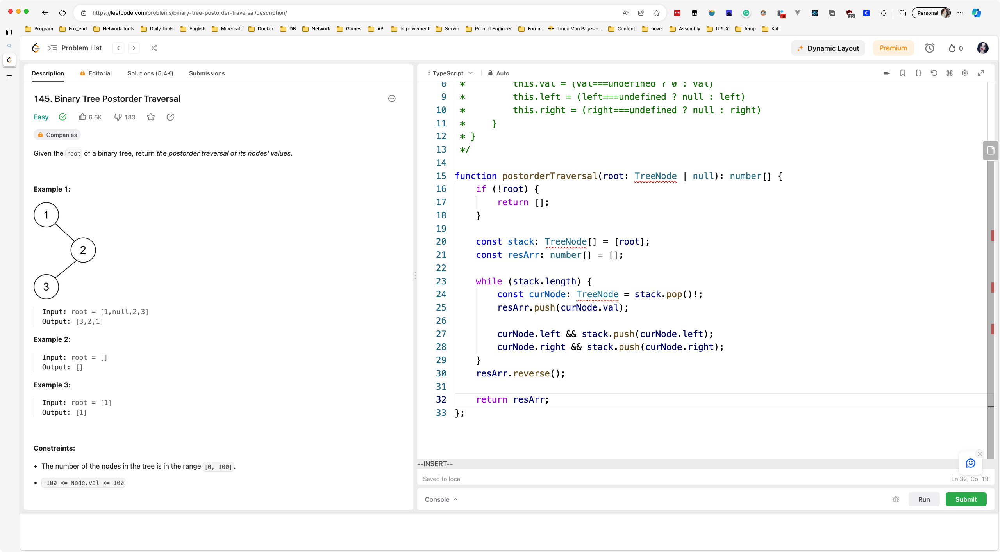

# Day006

&nbsp;

# Day007

&nbsp;

# Day008

&nbsp;

# Day009

&nbsp;

# Day010

&nbsp;

# Day011

&nbsp;

# Day012

&nbsp;

# Day013

&nbsp;

&nbsp;

# Day014

&nbsp;

&nbsp;

# Day015

&nbsp;

# Day016

&nbsp;

&nbsp;

# Day017

&nbsp;

&nbsp;

