# Day067

&nbsp;

# Day068

&nbsp;

# Day069

&nbsp;

# Day070

&nbsp;

# Day071

&nbsp;

# Day072

&nbsp;

# Day073

&nbsp;

# Day074

&nbsp;

# Day075

&nbsp;

# Day076

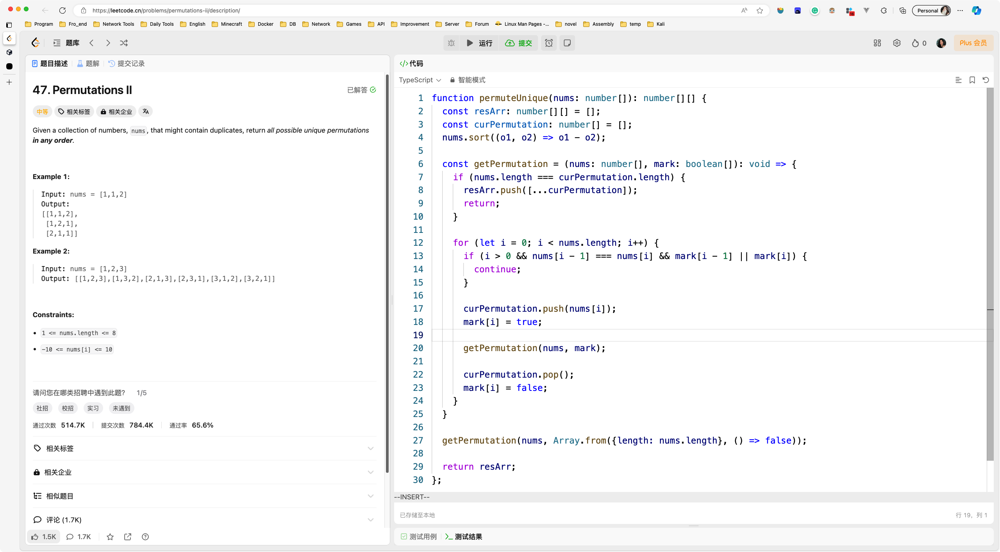

&nbsp;

# Day077

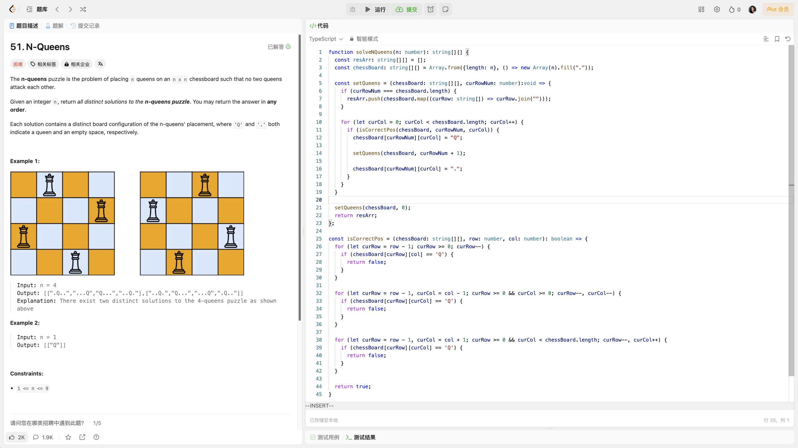

&nbsp;

# Day078

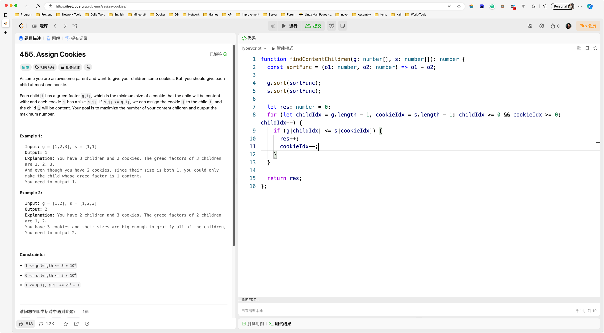

&nbsp;

# Day079

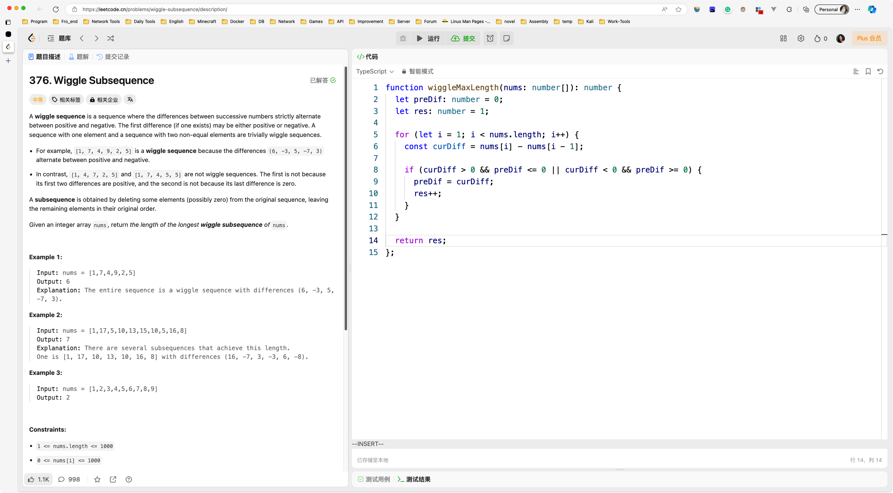

&nbsp;

# Day080

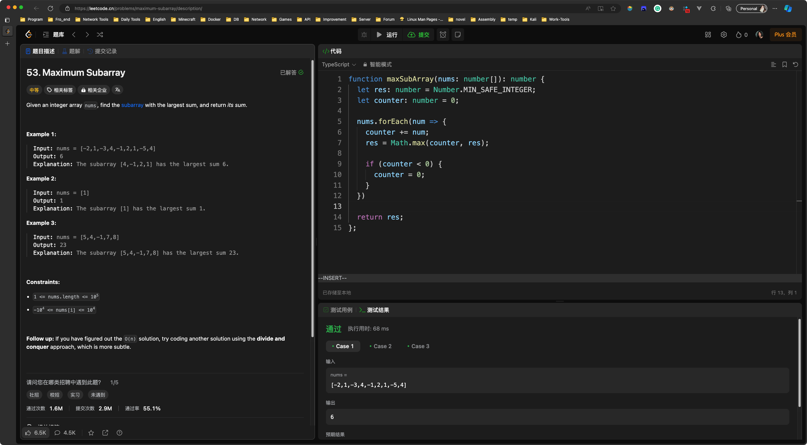

&nbsp;

# Day081

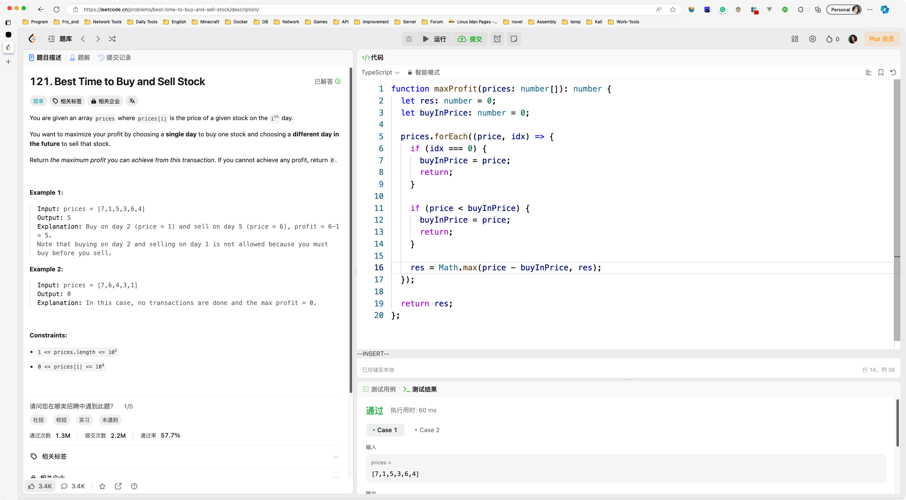

&nbsp;

# Day082

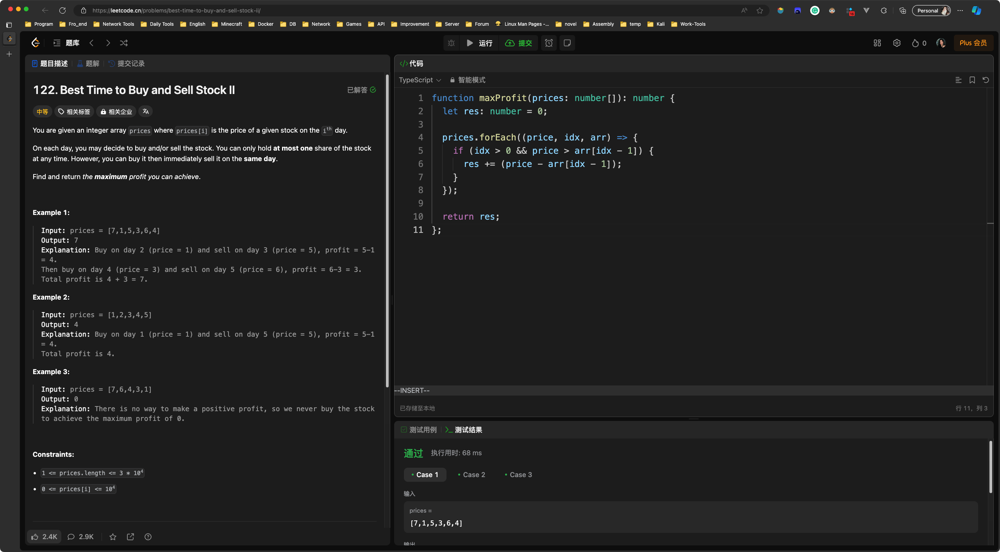

&nbsp;

# Day083

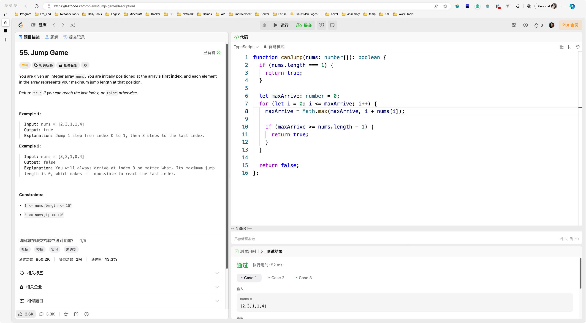

&nbsp;

# Day084

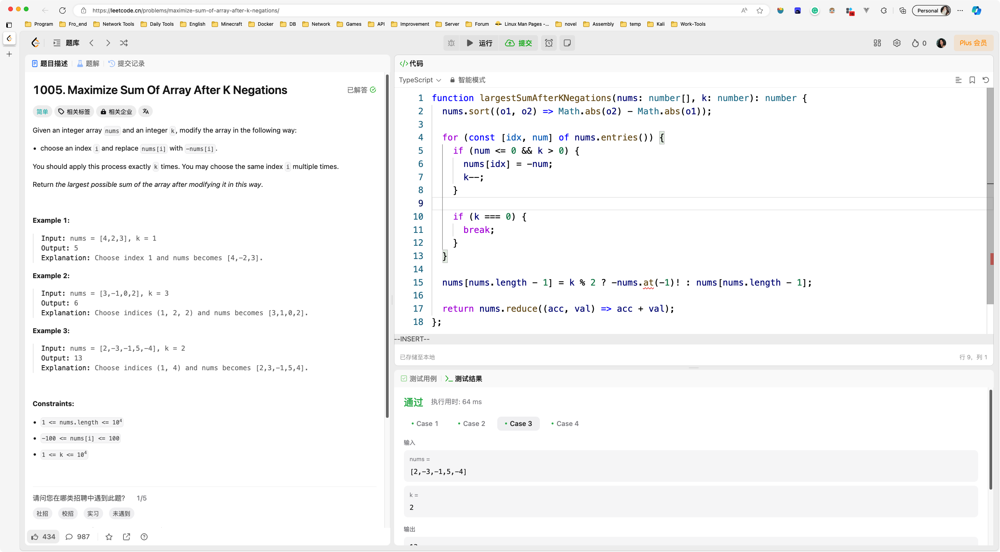

&nbsp;

# Day085

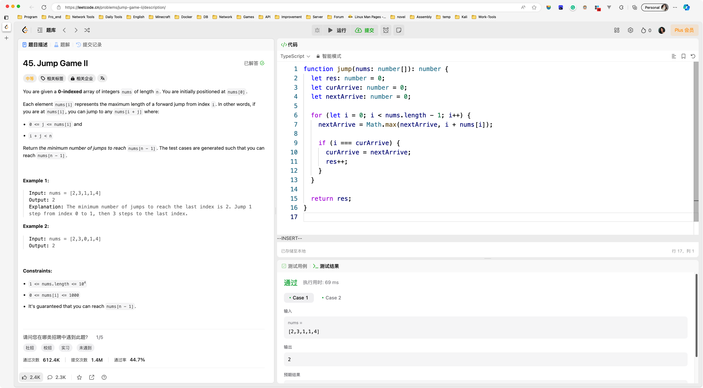

&nbsp;

# Day086

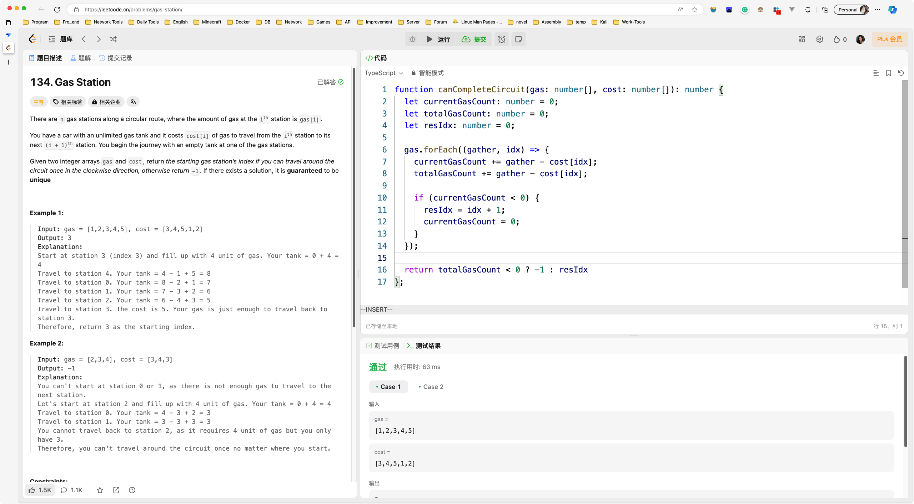

&nbsp;

# Day087

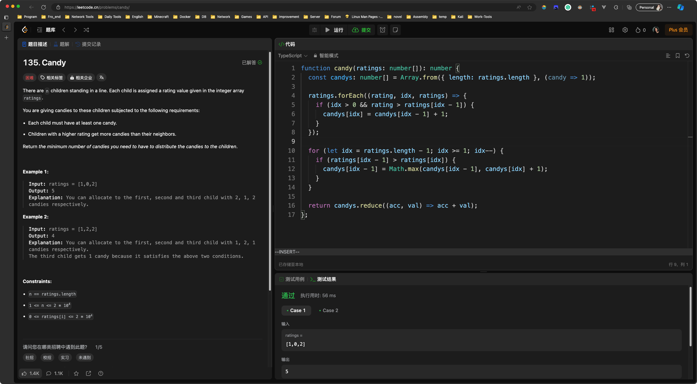

&nbsp;

# Day088

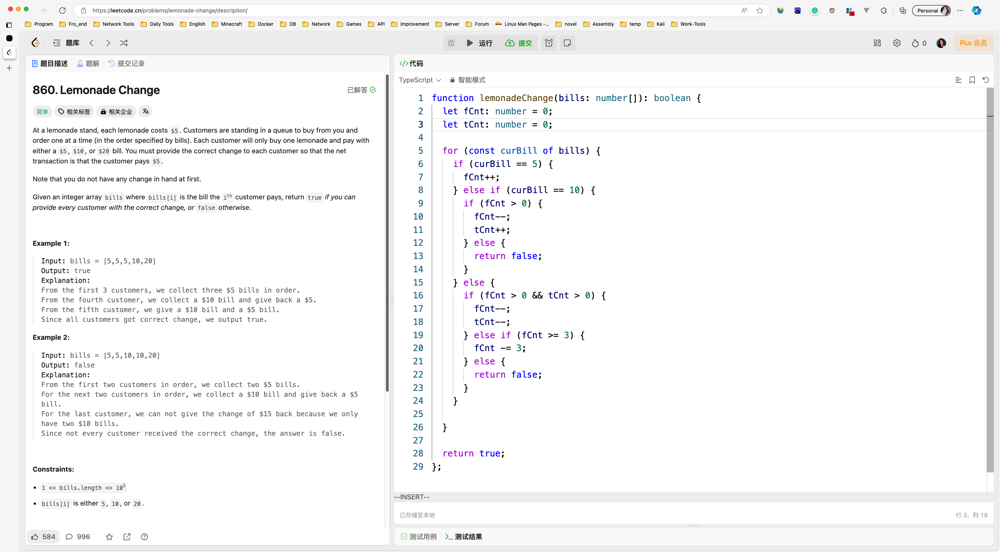

&nbsp;

# Day089

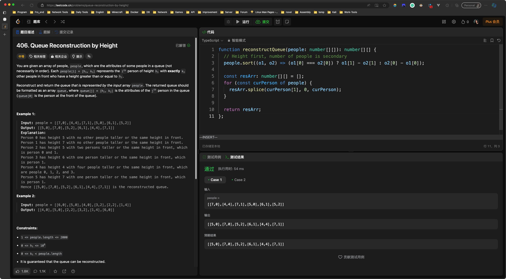

&nbsp;

# Day090

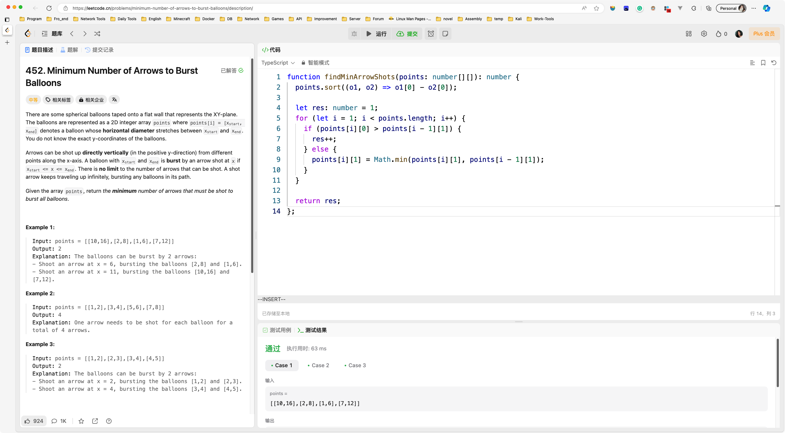

&nbsp;

# Day091

&nbsp;

# Day092

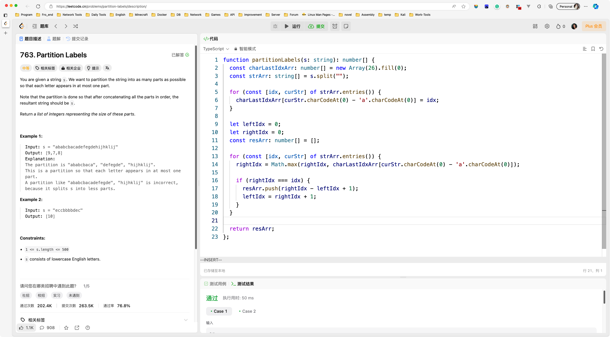

&nbsp;

# Day093

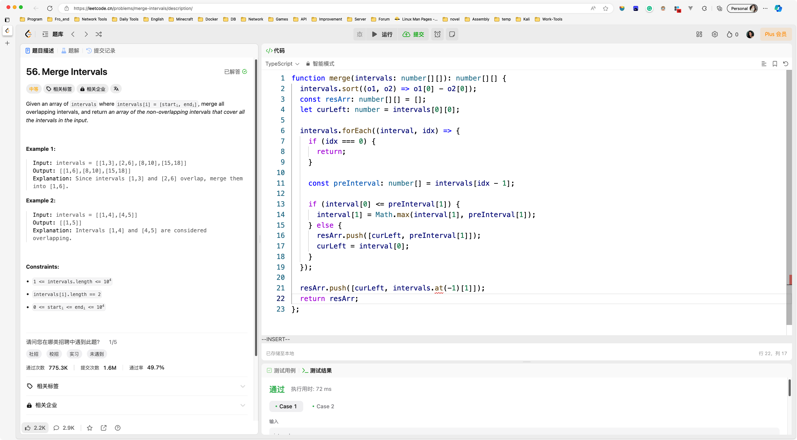