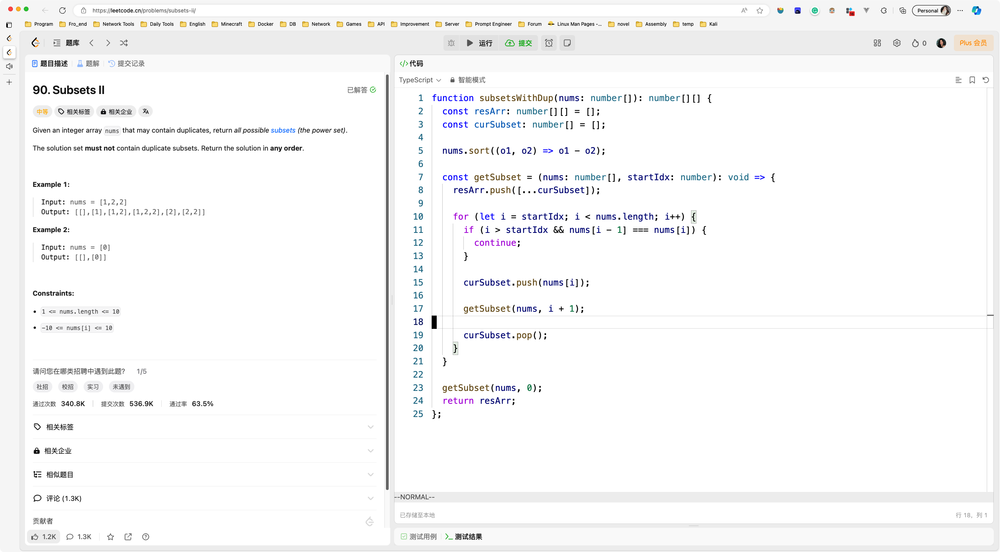
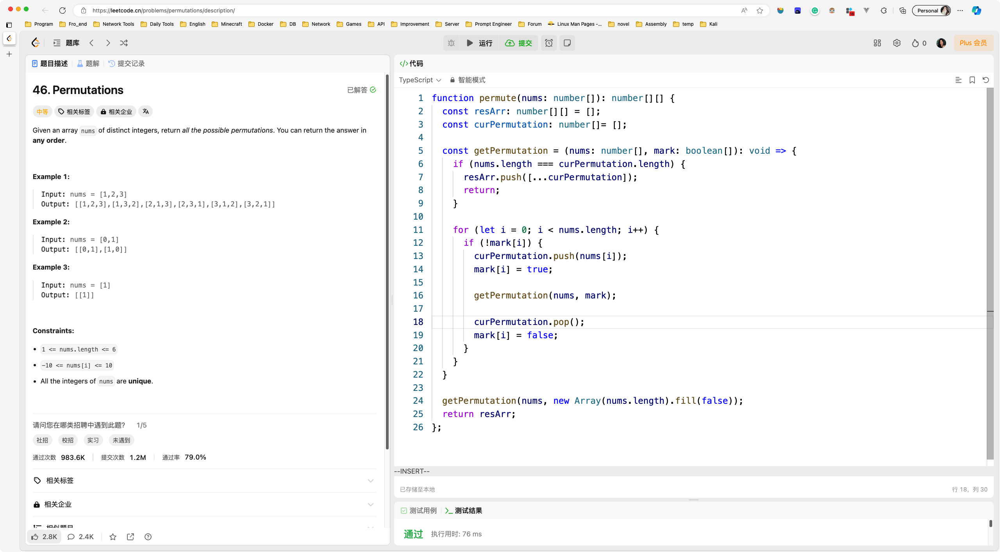

# Day067

&nbsp;

# Day068

&nbsp;

# Day069

&nbsp;

# Day070

&nbsp;

# Day071

&nbsp;

# Day072

&nbsp;

# Day073

&nbsp;

# Day074

&nbsp;

# Day075

&nbsp;

# Day076

&nbsp;

# Day077

&nbsp;

# Day078

&nbsp;

# Day079

&nbsp;

# Day080

