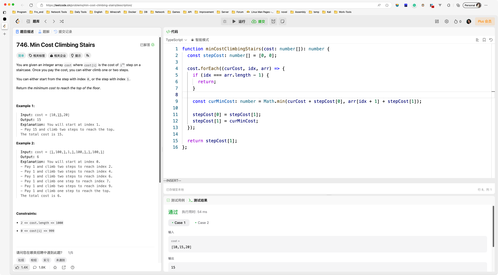
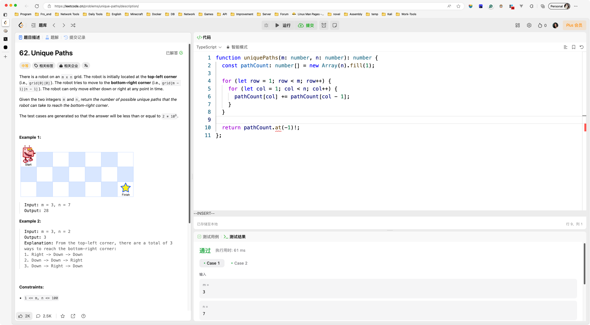
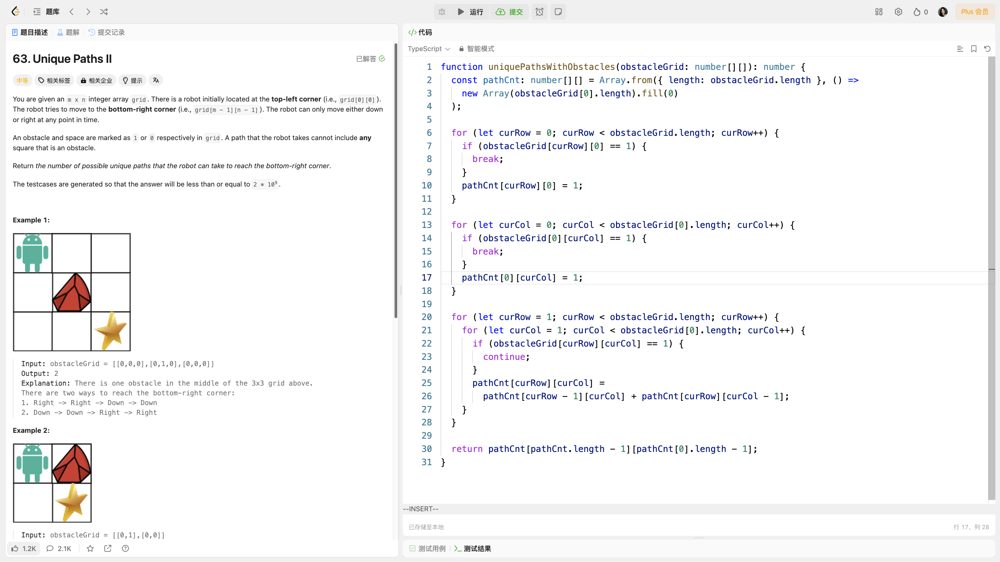
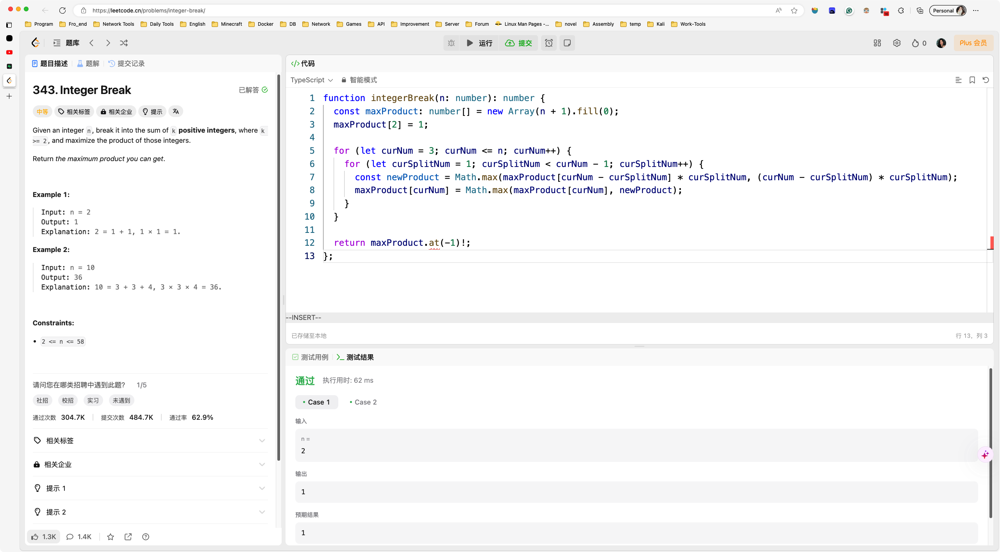
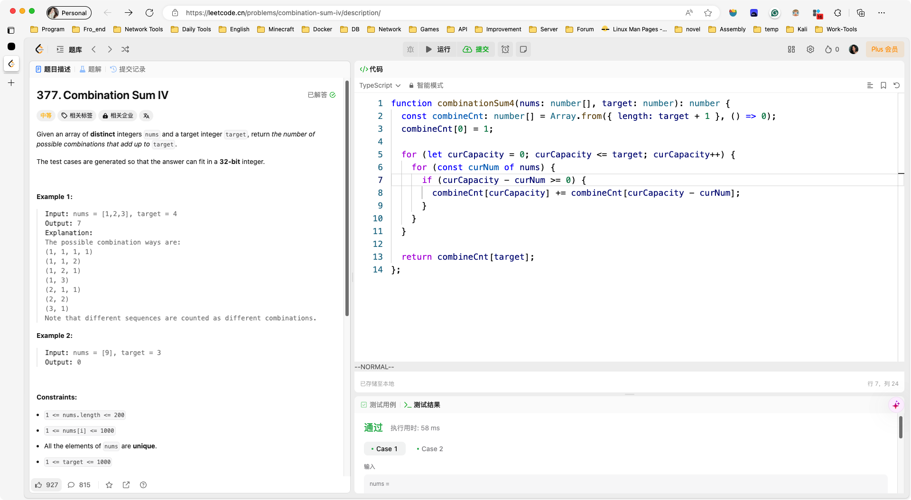
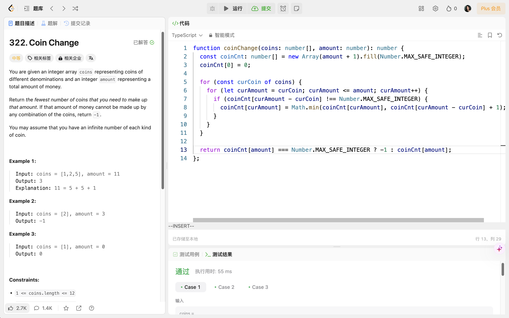
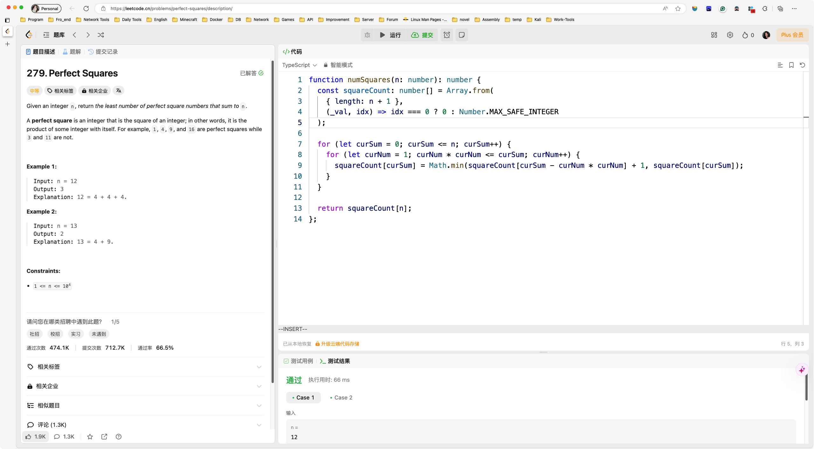
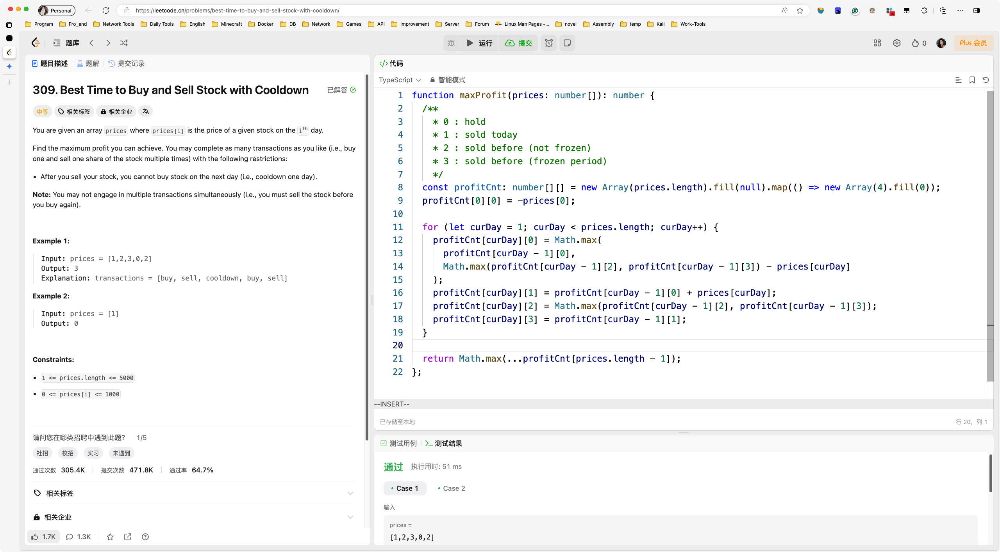
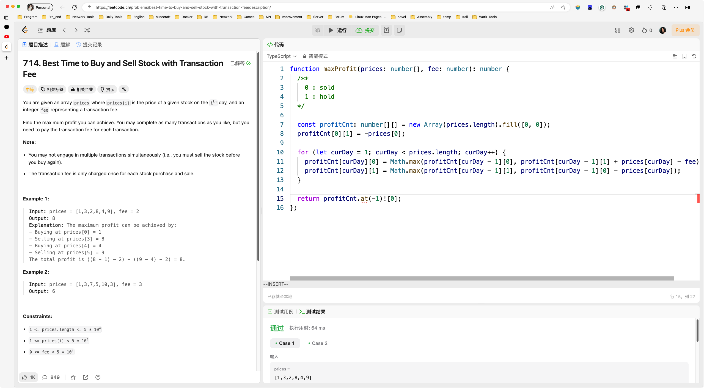

# Day098

&nbsp;

# Day099

&nbsp;

# Day100

&nbsp;

# Day101

&nbsp;

# Day102

&nbsp;

# Day103

&nbsp;

# Day104

&nbsp;

# Day105

&nbsp;

# Day106

&nbsp;

# Day107

&nbsp;

# Day108

&nbsp;

# Day109

&nbsp;

# Day110

&nbsp;

# Day111

&nbsp;

# Day112

&nbsp;

# Day113

&nbsp;

# Day114

&nbsp;

# Day115

&nbsp;

# Day116

&nbsp;

# Day117

&nbsp;

# Day118

&nbsp;

# Day119

&nbsp;

# Day120

&nbsp;

# Day121

