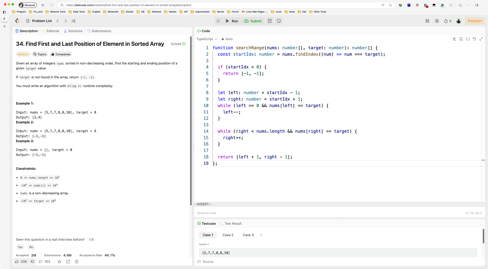
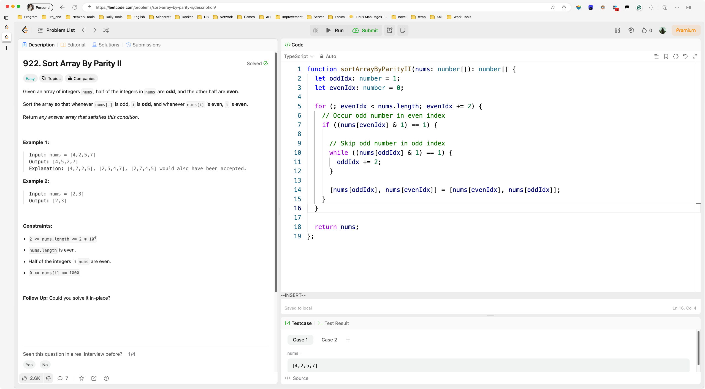

# Day127

&nbsp;

# Day128

&nbsp;

# Day129

&nbsp;

# Day130

&nbsp;

# Day131

&nbsp;

# Day132

&nbsp;

# Day133

&nbsp;

# Day134

&nbsp;

# Day135

&nbsp;

# Day136

&nbsp;

# Day137

&nbsp;

# Day138

&nbsp;

# Day139

&nbsp;

# Day140

&nbsp;

# Day141

&nbsp;

# Day142

&nbsp;

# Day143

&nbsp;

# Day144

&nbsp;

# Day145

&nbsp;

# Day146

&nbsp;

# Day147

&nbsp;

# Day148

