# Day158

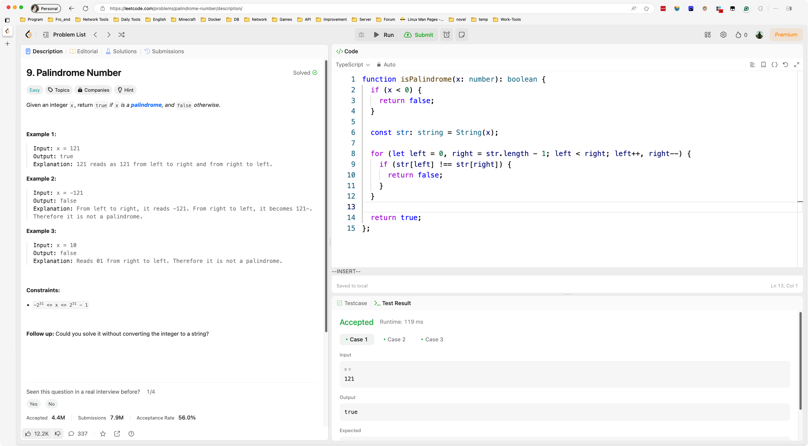

&nbsp;

# Day159

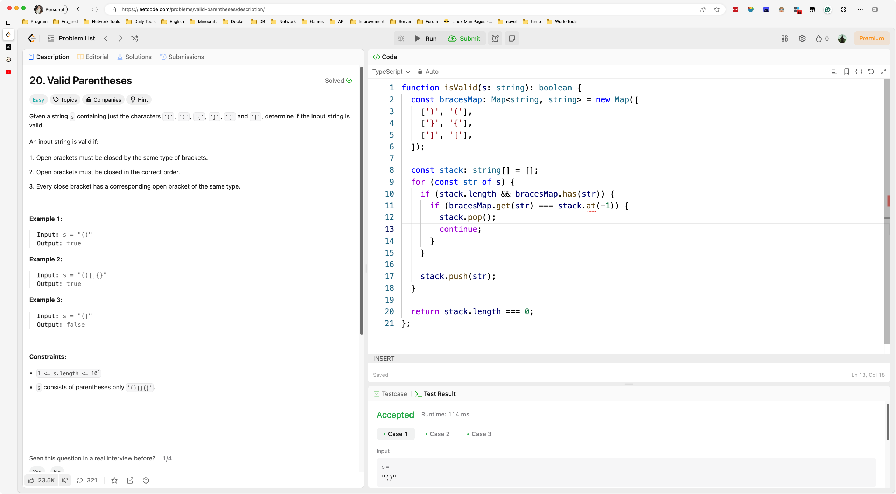

&nbsp;

# Day160

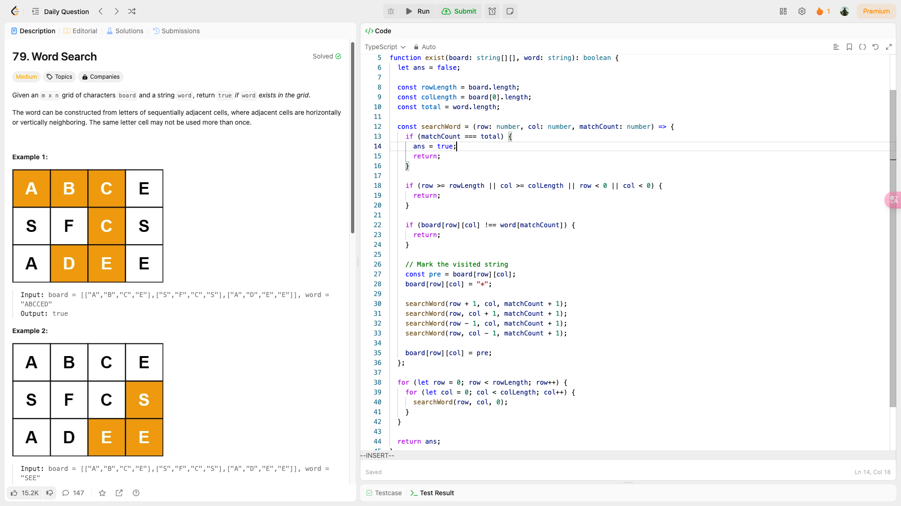

&nbsp;

# Day161

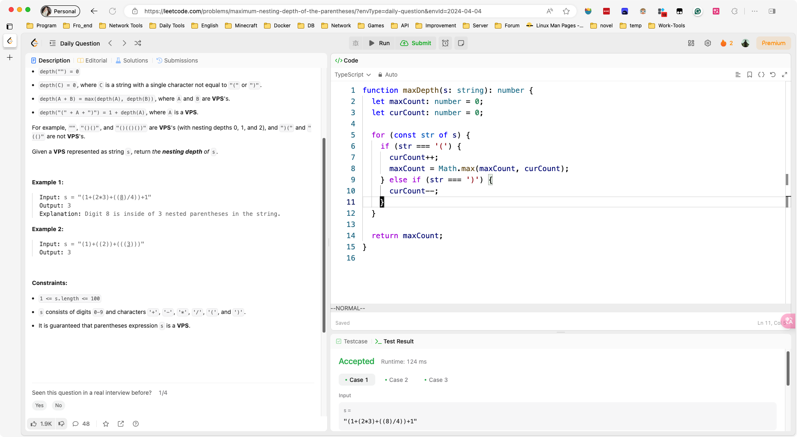

&nbsp;

# Day162

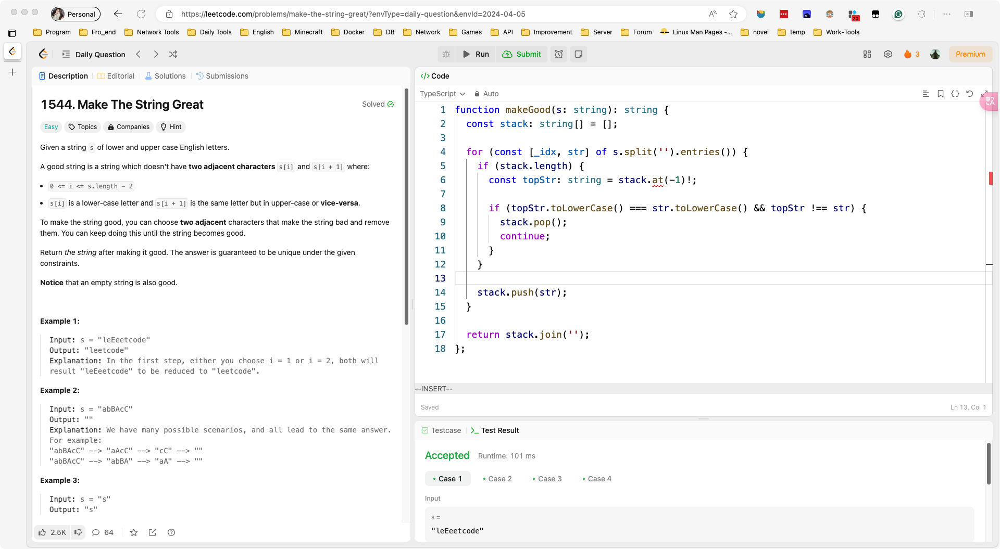

&nbsp;

# Day163

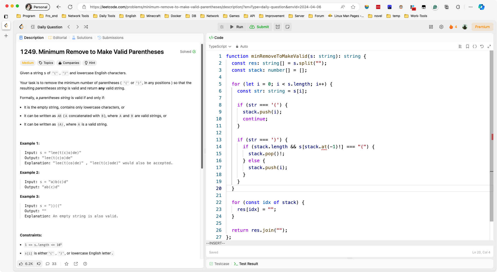

&nbsp;

# Day164

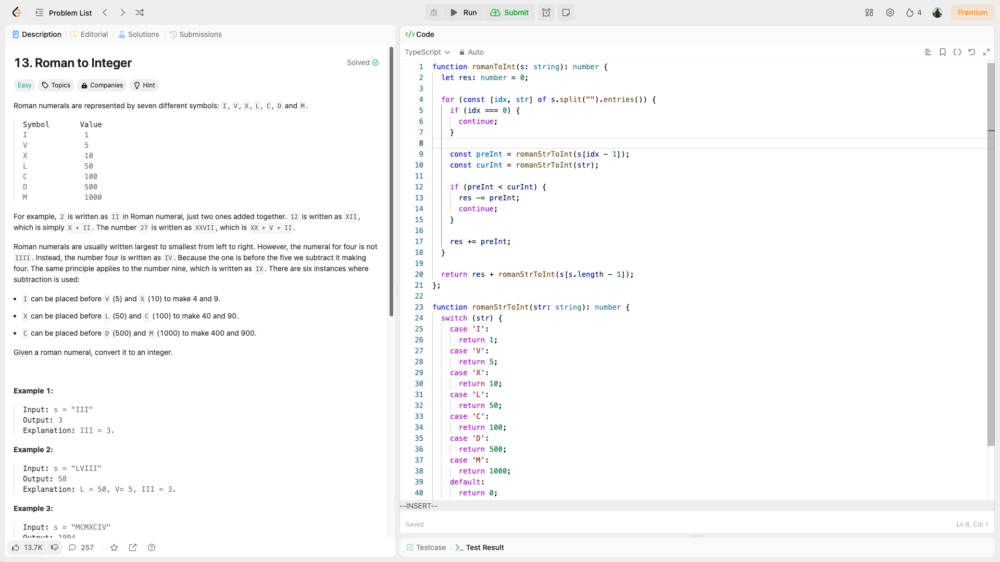

&nbsp;

# Day165

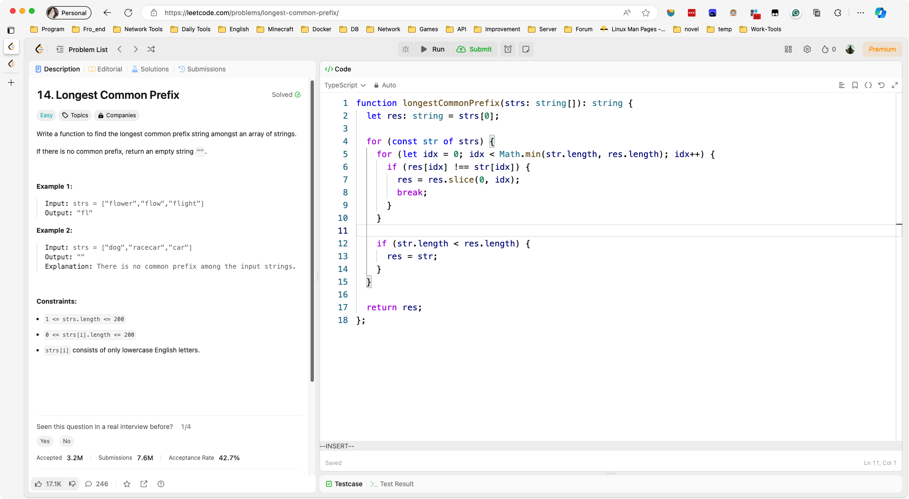

&nbsp;

# Day166

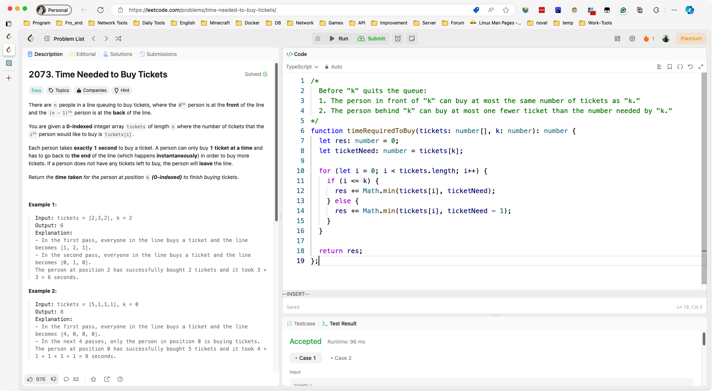

&nbsp;

# Day167

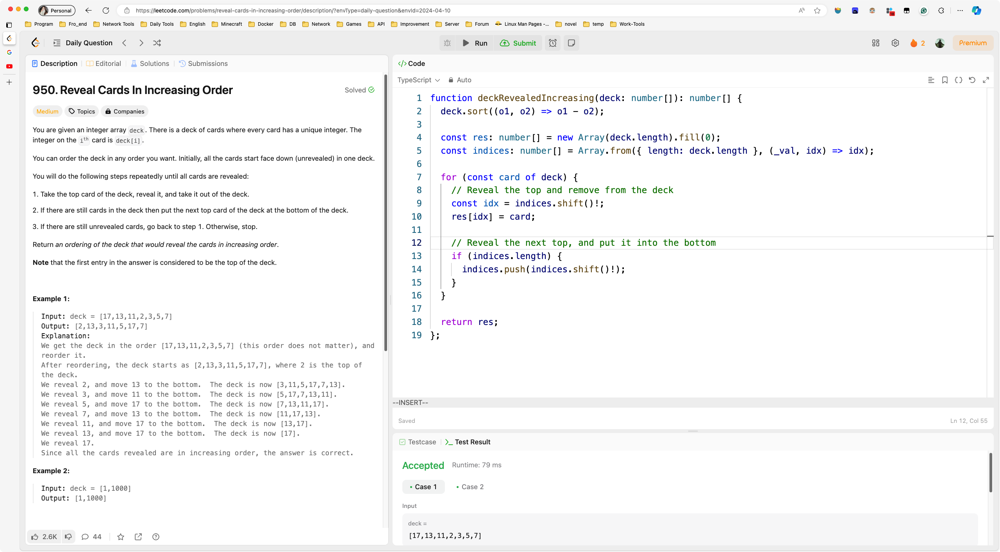

&nbsp;

# Day168

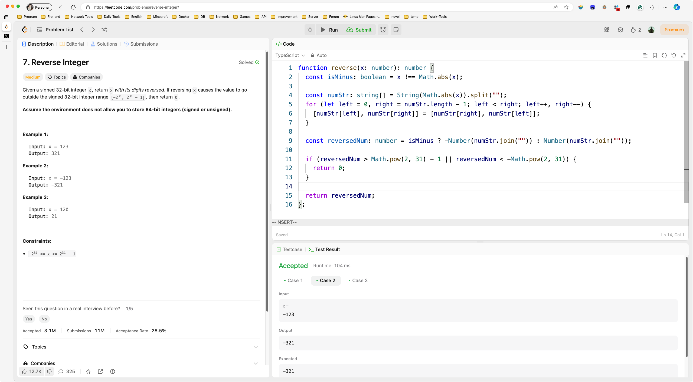

&nbsp;

# Day170

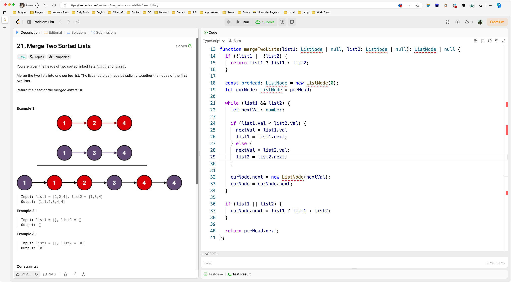

&nbsp;

# Day171

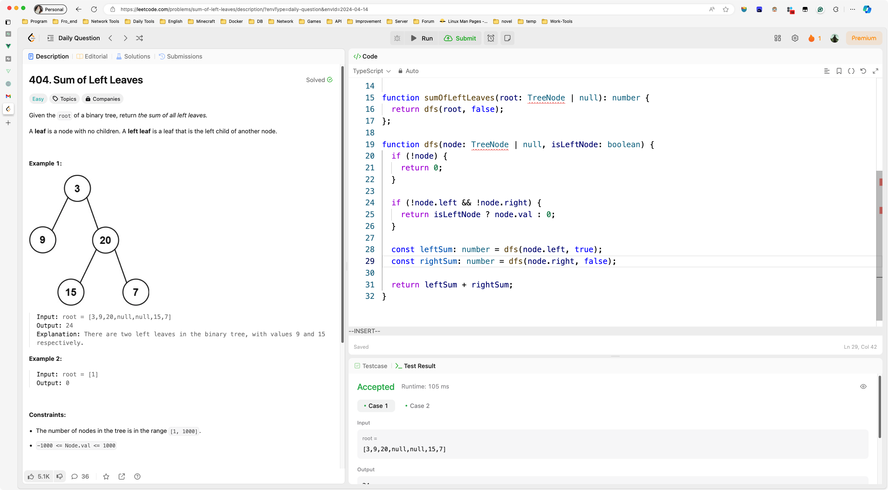

&nbsp;

# Day172

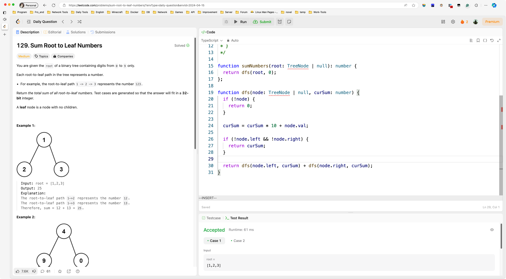

&nbsp;

# Day173

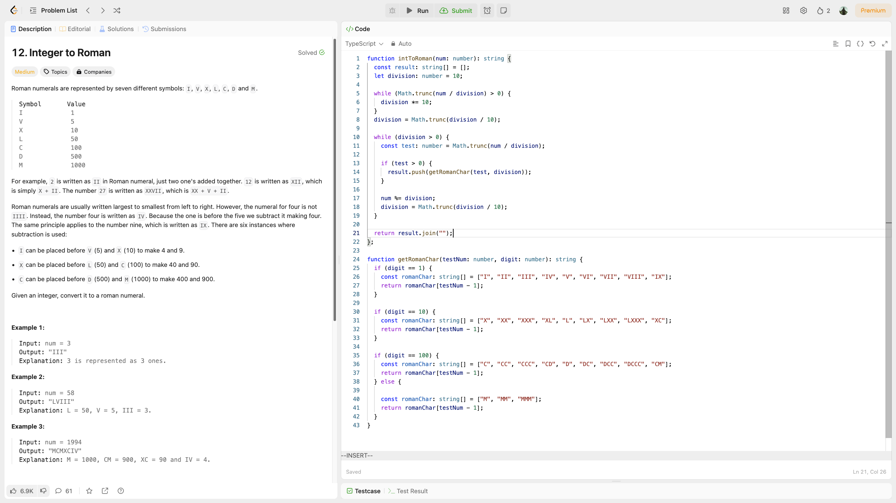

&nbsp;

# Day174

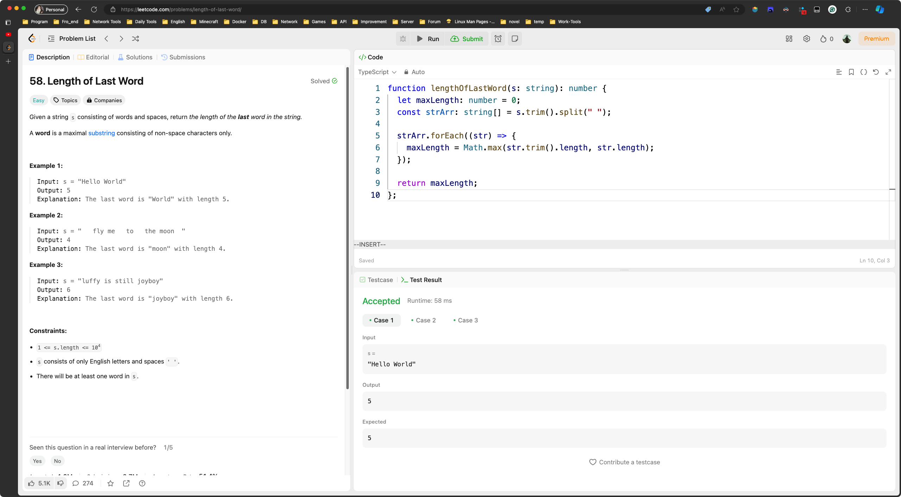

&nbsp;

# Day175

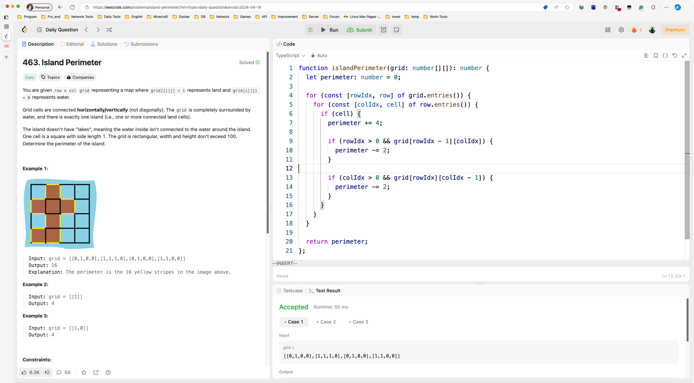

&nbsp;

# Day176

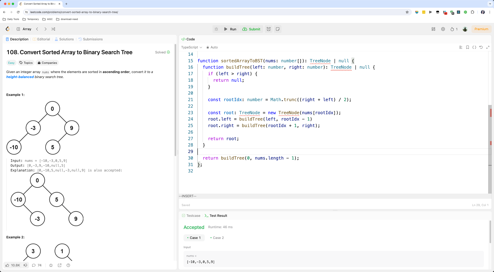